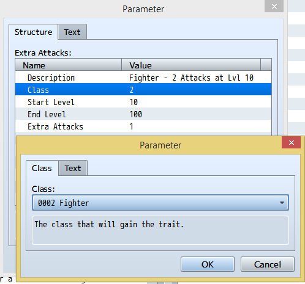

# Level-based Traits

## Introduction

Alright! My Fire Mage has all her awesome fiery skills of fieriness. Now all she needs are fire-based traits to go with them and she ... will ... be ... finished. Okay, so she should probably start out with 10% fire protection and it’ll scale up until around level 50 where she will gain full immunity. Let’s enter this into the editor and … uhhh … crap! * sad trombone *

By default RPG Maker only gives you the ability to make it so that a character either has a trait or doesn’t have a trait. There’s no in-between. Full fire immunity seems a bit too much for a level 1 Fire Mage. And what about my Fighter? He was supposed to get an extra attack every 10 levels? He can’t start with 6 attacks!!!

Well fear not, you can now do these things and more. Actually, you’ve been able to for quite some time with other plugins, so why does this one even exist? I’m glad you asked! All of these other plugins were developed before RPG Maker MV 1.5 which means they rely on you learning how MV stores and processes traits in order to utilize them. So you have to navigate look-up tables and then enter cryptic text into Note tags that you'll totally remember the meaning of a few weeks from now. /s

That’s where this plugin comes into play. I’ve been trying to figure out a good way to implement this feature into RPG Maker MV for a while and the plugin upgrade for 1.5 finally made it possible. Now you can define level-based traits in an easy to understand way that closely resembles the editor itself.

It's just like using the editor to add traits but with more power.

Here are few examples of what you can easily do as your characters go up in level.
* Adjust Elemental Resistance
* Increase Hit%, Critical% and/or Evade%
* Resist status ailments better
* Gain immunity to Poison and/or Disease
* Gain Extra Attacks
* Reduce Floor Damage
* Gain a chance to Poison or Blind when attacking
* Gain addition Skill Types
* Gain new weapon and armor proficiencies
* No longer risk being surprised during encounters

## How to Use

Using this plugin is easy. I’m kind of hoping that will become my signature. Just about everything you need is right there in the parameters. Every beneficial trait that is relevant to actors, classes or races is listed along with several parameters. I've separated this plugin into three so that you can add only the functionality you need. If you only want to use this for classes and not the others, you can just install that. Having all of this in one plugin was a bit messier in the parameters and required more processing power if you only need one or two of these. If you do need level-based traits for actors, classes and races then just install all three plugins and you're good to go.

**Description** - This is text that you’ll want to enter so that you’ll know what that particular level-based trait is. An example would be something like “Fire Mage - 20% Fire Resist Lvl 1”. This isn’t required but is very helpful so you know what each one is doing at a glance.

**Class/Actor/Race** - This is where you select the class, actor or race that this level-based trait belongs to.

**Start Level** - This is the level that the actor or class gains this trait.

**End Level** - This is the level that this trait will expire. Because of the way MV stacks traits, it’s often times better to remove one and then replace it with a better version. Otherwise, newer version will be combined and produce harder to manage results.

**Trait-specific Parameters** - There will always be one or two parameters that you will fill in just as you would in the editor itself. Most of the time, you’ll be able to select easy to understand options from drop-down lists like “Encounter Half” for Party Ability. The exception to this are your custom Types in the database. For whatever reason, the 1.5 plugin parameters don’t have an option to generate a select list from these so you have to enter in the ID until this oversight is remedied.

Examples:

*I want my Fighter to gain an extra attack every 10 levels.*

Under Class-based Traits -> Attack -> Extra Attacks, enter in these parameter values. Because Extra Attacks are added and not multiplied, you can just add one extra attack every 10 levels and they will accumulate.

Description: Fighter Lvl 10 - 2 Attacks
Class: Select Fighter from the list
Start Level: 10
End Level: 100 (This is always the default end value)
Extra Attacks: 1

Description: Fighter Lvl 20 - 3 Attacks
Class: Select Fighter from the list
Start Level: 20
End Level: 100
Extra Attacks: 1

… do the same for levels 30 and 40 …

Description: Fighter Lvl 50 - 6 Attacks
Class: Select Fighter from the list
Start Level: 50
End Level: 100
Extra Attacks: 1

*I want my Fire Mage to gain fire resistance as she levels up.*

By adding a short description, you can know at a glance what each entry is doing.

Under Class-based Traits -> Rates -> Element Rate, enter in these parameter values. Because Element Rate is multiplied when stacked, you’ll want to set each one to expire when the next kicks in so that only one is ever added to the actor or class at a time.

Description: Fire Mage Lvl 1 - 20% Resist
Class: Select Fire Mage from the list
Start Level: 1
End Level: 10
Element ID: 2 (Sorry, no way to make list from this)
Percentage: 80

Description: Fire Mage Lvl 10 - 40% Resist
Class: Select Fire Mage from the list
Start Level: 10
End Level: 20
Element ID: 2
Percentage: 60

Description: Fire Mage Lvl 20 - 60% Resist
Class: Select Fire Mage from the list
Start Level: 20
End Level: 30
Element ID: 2
Percentage: 40

Description: Fire Mage Lvl 30 - 80% Resist
Class: Select Fire Mage from the list
Start Level: 30
End Level: 40
Element ID: 2
Percentage: 20

Description: Fire Mage Lvl 40 - Fire Immunity
Class: Select Fire Mage from the list
Start Level: 40
End Level: 100
Element ID: 2
Percentage: 0

## Races

Install FROG_RaceCore and place it in the list before this plugin.  This allows you to define traits for your actors based on what race is assigned to them.  The only difference with this version of the plugin is that you can't select a race from a drop-down as they don't don't exist within RPG Maker itself. You will need to type in the Race ID as defined within the RaceCore plugin when you create the traits that define its advantages and disadvantages.

For my examples, I’ll draw mostly from Dungeons & Dragons where such a system is part of the core character creation mechanic. Like D&D, my examples will all apply at level 1 and be permanent but this plugin does allow you to be more creative and have them scale up with level like in the examples I detailed for actors and classes.

Example:

**Dwarf**

This race is usually quite hearty and has better constitution than most. As such, they would likely receive a bonus to Max HP and better resistance to Poison. They also tend to be more resistant to Magic.

Under Race-based Traits -> Param -> Parameter -> Max HP, enter in these parameter values.
Description: Dwarven HP Up
Race: Dwarf
Start Level: 1
End Level: 100
Parameter: Max HP
Percentage: 110

Under Race-based Traits -> Rate -> State Rate -> Poison, enter in these parameter values.
Description: Dwarven Poison Resistance
Race: Dwarf
Start Level: 1
End Level: 100
Parameter: Poison
Percentage: 50

Under Race-based Traits -> Param -> Parameter -> Magic Defense, enter in these parameter values.
Description: Dwarven Magic Resistance
Race: Dwarf
Start Level: 1
End Level: 100
Parameter: Magic Defense
Percentage: 120

**Elf**

This race is typically more lean and nimble than most others. They are usually more attuned with Magic as well. As such, they would receive a bonus to Agility and Magic Attack but take a penalty to Max HP and be more susceptible to Poison. Elves are also taught to use swords and bows from a young age so should gain weapon proficiency in those. They may need to have a slight decrease to Defense as well to balance them out. I’m not going to list out how to set this one or the other common race archetypes as it should be pretty easy to figure out. If you need any help with this, just ask.

**Script Calls and Plugin Commands**

All races are initially assigned a Default Race that can be configured within the plugin parameters. It doesn't make much sense to just assign races as you could just as easily give the relevant traits to the actor or class instead. So typically, you'll allow the player to choose their character's race and use one of the following two methods to assign it. You can also get any actor’s race if you need to use it outside of this plugin.

Script Commands to get and set races
* FROG.LBTR.setRace(actorId, race);
* FROG.LBTR.getRace(actorId);

Plugin Commands to get and set races (Don't include the brackets)
* SET_RACE [actorId] [race]
* GET_RACE [actorId] [variableId]

This plugin contains a lot of parameters and while everything seems to work for me, it's difficult to test out all of the functionality. I'm marking this as beta until I and others have had a chance to use it more thoroughly and fix any bugs that may be present. If you find an issue, let me know and I will get a new version up promptly. Thanks!
